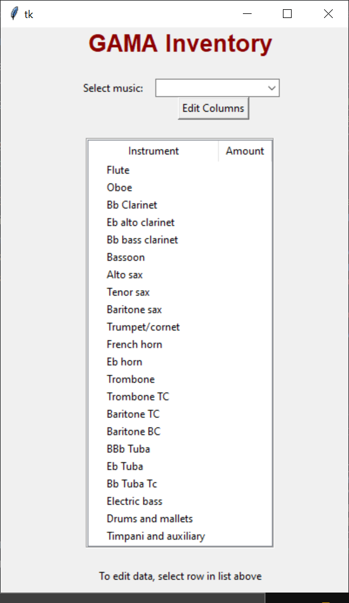
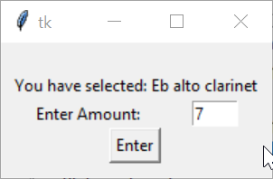
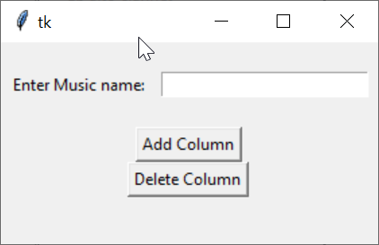

# Python - Inventory Manager

## Sections 
- [Description](#description)
- [Getting Started](#getting-started)
    - [Dependencies](#dependencies)
    - [Installing](#installing)
    - [Setting Up](#setting-up)
    - [Preparing Sheets and Code] (#preparing-the-sheets-and-code)
    - [Executing](#executing)
- [Author](#author)
- [License](#license)

---
## Description
This is a simple inventory manager program using the Tkinter package for Python and using Google Sheets API to store and edit data. The program grabs data from the specified Google Sheets spreadsheet and displays it onto the treeview widget when selected. The data on the treeview widget can be selected and edited and then updates the Google Sheets spreadsheet in real time. 

**Features Include:**
- Editing cell values
- Adding/Deleting Columns 
- Selecting/Displaying Columns 

> **Note:** Project was made to be used for a school organization called GAMA for  organizing sheet music, hence the name of the python file and variable names. 

Shown below is the screen which appears when the program is run and a column is selected from thedropdown menu. <br />


Below is the dialogue which is displayed when a value/instruument in the treeview grid is selected. <br />



Below is the dialogue which is displayed when the "Edit Columns" button is selected. <br /> 


---
## Getting Started

### Dependencies
- Python 3.6.0+
- Oauth2client 4.1.0+ 
```bash
pip install oauth2client
```
- gspread 3.6.0 
```bash
pip install gspread
```
- Mac/Windows OS

<br />

### Installing 
```bash
$ git clone https://github.com/JugalBili/Python-GUI-Inventory-Manager
```
Or you can download the zip directly from github. 

<br />


### Setting Up
This code will not run without following the set up process stated below. As this program uses the Google API, it requires a set-up process to get your keys, client_email, and client_id. 

1. Head over to [Google Developer Console](https://console.developers.google.com/cloud-resource-manager) and create a new project (leave the "Location" box as is) or select an already existing one 
2. In the box labeled “Search for APIs and Services”, search for “Google Drive API” and "Google Sheets API" and enable them both. ***Make sure the correct project is selected on the top left, beside the "Google APIs" logo***  
3. Now, click on the "APIs & Services" text located on top of the name of the API. Look at the image below as a reference 
4. Then, click on the "Credentials" tab on the left sidebar, press "Create Credentials" and select "Service Account"
5. Enter a name of your choice, and add a description and then press create
6. Select the role of Editor under the Project category, then press continue, and then done.  
7. Next, press the edit icon (pencil icon) beside the service account you just created and scroll down until you reach the heading called "Key"
8. Select: Add Key > Create New Key > JSON > Create, and save the json file to a safe location on your computer. 
9. Copy the contents of the json file to the creds.json file in this project folder

<br />


### Preparing the Sheets and Code

Before executing, you must 


<br />

### Executing
To execute to program, open the zip file into an IDE of your choice, or use the following in the termial: 
```bash
python Gama_Inventory.py
```
> **Make Sure** to run the command inside the folder

---
## Author 
**Jugal Bilimoria**
<br />September 4th 2020

<br />Project was made for a highschool school music organization called GAMA (Glenforest ASsociation of Musical Arts) to help keep track of individual sheet music for each instrument. 

---
## License 


MIT License

Copyright (c) 2020 Jugal Bilimoria

Permission is hereby granted, free of charge, to any person obtaining a copy
of this software and associated documentation files (the "Software"), to deal
in the Software without restriction, including without limitation the rights
to use, copy, modify, merge, publish, distribute, sublicense, and/or sell
copies of the Software, and to permit persons to whom the Software is
furnished to do so, subject to the following conditions:

The above copyright notice and this permission notice shall be included in all
copies or substantial portions of the Software.

THE SOFTWARE IS PROVIDED "AS IS", WITHOUT WARRANTY OF ANY KIND, EXPRESS OR
IMPLIED, INCLUDING BUT NOT LIMITED TO THE WARRANTIES OF MERCHANTABILITY,
FITNESS FOR A PARTICULAR PURPOSE AND NONINFRINGEMENT. IN NO EVENT SHALL THE
AUTHORS OR COPYRIGHT HOLDERS BE LIABLE FOR ANY CLAIM, DAMAGES OR OTHER
LIABILITY, WHETHER IN AN ACTION OF CONTRACT, TORT OR OTHERWISE, ARISING FROM,
OUT OF OR IN CONNECTION WITH THE SOFTWARE OR THE USE OR OTHER DEALINGS IN THE
SOFTWARE.